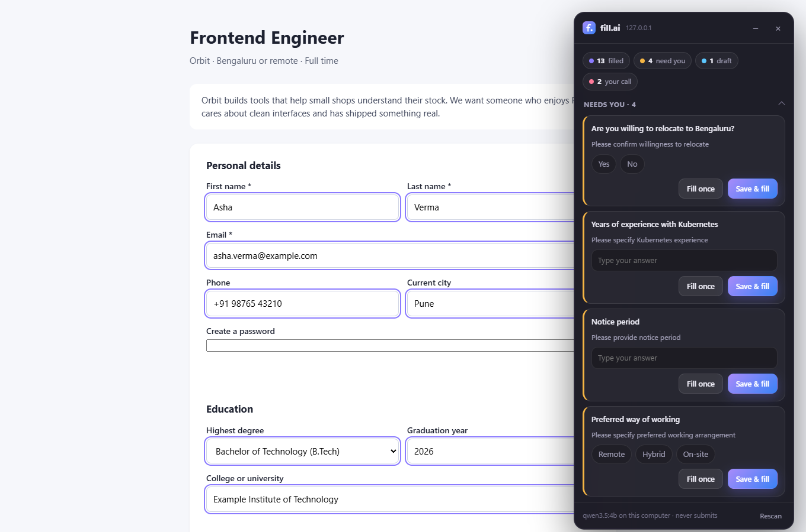
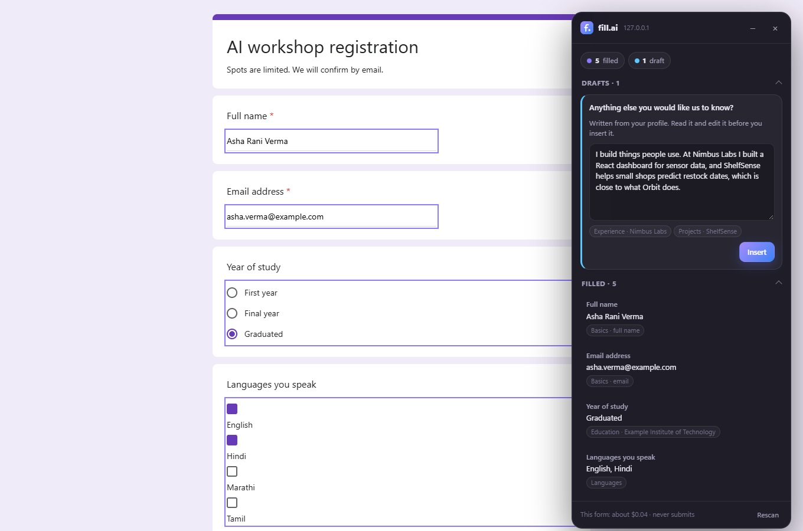
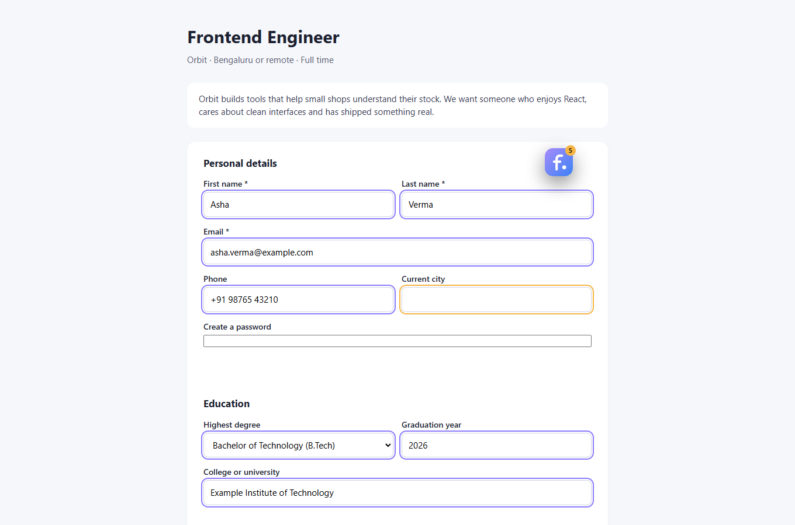
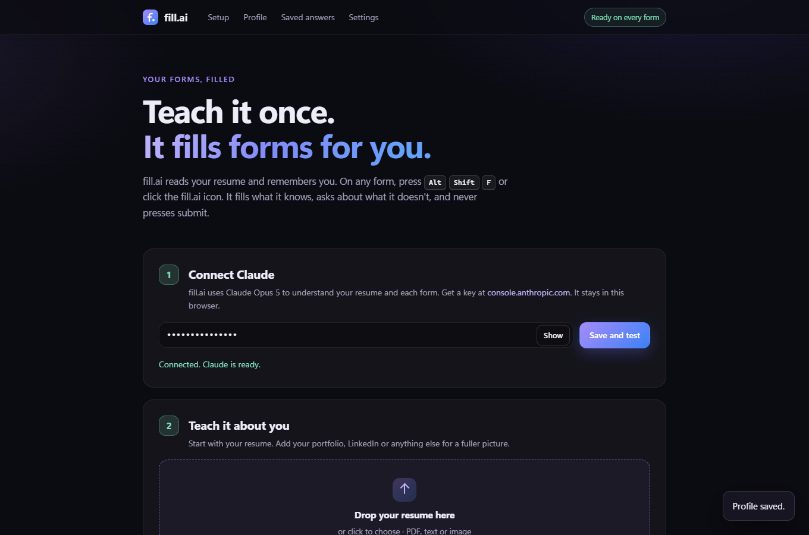

# Fill.ai

**Forms, filled by an AI that actually knows you.**

Job applications, college portals, Google Forms: every one asks the same things in a slightly different layout. Fill.ai reads your resume once, remembers you, and from then on fills forms for you. It fills what it knows, asks you about what it doesn't, and never presses submit.

It runs free on your own computer by default. Nothing about you has to leave it.



<sub>Every screenshot here uses a made-up test profile. The one above is a real run of the local model on a laptop GPU.</sub>

## What it does

1. **Teach it once.** Drop in your resume PDF, add your portfolio or LinkedIn link and anything else you like. The AI reads it all and builds a structured profile: education, experience, projects, skills, links, contact details. You can see and edit every line.
2. **Open any form** and press <kbd>Alt</kbd> <kbd>Shift</kbd> <kbd>F</kbd> (or click the Fill.ai icon). A small panel appears in the corner. Drag it anywhere, or shrink it to a button.
3. **It reads the form and fills what it knows.** Names, email, phone, links, degree, college, graduation year, skills checkboxes, dropdowns, even the resume upload.
4. **It asks about the rest.** Each field it couldn't answer gets a card. Answer it and choose **Fill once**, or **Save & fill** to remember the answer for every future form.
5. **You check, then you submit.** Fill.ai never submits anything.

| Google Forms | Shrinks out of the way |
| --- | --- |
|  |  |

## Choose the AI

Pick one on the settings page. You can switch any time; your profile stays.

| | On this computer | Gemini | Claude |
| --- | --- | --- | --- |
| Cost | Free | Free tier | Paid, a few cents a form |
| Your data goes to | Nowhere | Google | Anthropic |
| Needs | [Ollama](https://ollama.com) and a graphics card | A free key from [AI Studio](https://aistudio.google.com/apikey) | A key from [console.anthropic.com](https://console.anthropic.com/settings/keys) |
| Reads PDFs | As text, extracted on your computer | Directly | Directly |
| Best for | Privacy, and anyone with a GPU | Laptops without a GPU | The most careful answers |

**On this computer** is the default. It runs `qwen3.5:4b` (3.4 GB) through Ollama. On an RTX 4060 laptop GPU a 20-question job form takes about 30 seconds on *Balanced* and 50 on *Careful*, and building a profile from a resume takes about 50 seconds. The very first request of a session also loads the model, which adds about half a minute. Any chat model in Ollama works; the settings page lists the ones you have.

**Gemini's free tier** has a catch you should know about: Google may use what you send on the free tier, your resume included, to improve its products. The settings page says so next to the key box.

**Claude** is the most careful of the three and needs an Anthropic API key with credit. API use is billed separately from a Claude.ai subscription.



## How it stays honest

An AI that fills forms for you is only useful if it never makes things up. Fill.ai does not rely on the model behaving; the code checks every answer before it touches the page, whichever AI gave it.

- **Every answer must cite your profile.** The model has to name where each answer came from (`education[0].institution`, a saved answer, ...). If the citation points at nothing, the answer is thrown away and the field goes to *Needs you*. The panel shows the source under each filled field. The one exception is attaching your saved resume to a field labelled resume or CV: the file is its own evidence.
- **Checkable facts are checked.** An email must be one that is actually in your profile, a phone number must match yours digit for digit, and a dropdown answer must be one of the real options.
- **Personal questions are always yours.** Gender, ethnicity, caste, religion, disability, veteran status and ID numbers are never filled automatically, whatever the model says.
- **Agreements are always yours.** Terms, privacy policies, arbitration and "I certify" boxes are never ticked for you.
- **Some things are never read at all.** Passwords, OTPs, captchas and card or bank details are skipped before anything is sent to the AI.
- **Hidden fields are ignored.** A form can hide a "phone" field to harvest autofill data. Fill.ai only reads fields a person can actually see.
- **Drafts are drafts.** Open questions such as "Why do you want to join us?" get a draft written from your profile, shown in the panel, and inserted only when you click *Insert*.

## Install

**[Download Fill.ai from www.mosambiswas.com/Fill.ai](https://www.mosambiswas.com/Fill.ai/)**, where the steps are shown with pictures.

Fill.ai is a Chrome extension (it also works in Edge, Brave and other Chromium browsers). It is not on the Chrome Web Store yet, so Chrome needs you to load it yourself, once:

1. Download [`fill-ai.zip`](https://github.com/BiswasMosam/Fill.ai/releases/latest/download/fill-ai.zip) and unzip it somewhere it can stay (Chrome runs Fill.ai from that folder).
2. Open `chrome://extensions`, switch on **Developer mode** and click **Load unpacked**. Choose the unzipped folder, the one with `manifest.json` inside. The settings page opens.
3. Choose the AI.
   - **On this computer:** install [Ollama](https://ollama.com/download), open it, and run `ollama pull qwen3.5:4b` once in a terminal. Press **Check again** and Fill.ai finds it and picks the model. There is no `OLLAMA_ORIGINS` to set: Fill.ai handles Ollama's block on browser extensions itself.
   - **Gemini** or **Claude:** paste your key and press **Save and test**.
4. Drop your resume into step 2 and press **Build my profile**. Check the result in *Your profile* and fix anything that is off.

To update, download the zip again, unzip it into the same folder replacing the files, and press the reload arrow on Fill.ai in `chrome://extensions`. Your profile stays.

## What goes where

- Your profile, saved answers, resume file and API keys live in this browser only (`chrome.storage.local`). Nothing is synced.
- When you fill a form, the form's questions, a short excerpt of the page (so drafts can mention the company) and your profile go to the AI you chose. With *On this computer* that is Ollama on `localhost`, so nothing leaves your machine at all. With Gemini it is Google's API, with Claude it is Anthropic's.
- **Export profile** gives you everything as JSON; **Delete everything** wipes it.

## Speed and cost

The **Fast / Balanced / Careful** switch in settings trades thoroughness for speed. On *Careful*, a local model thinks before it answers, Gemini uses a high thinking level and Claude thinks adaptively.

Local models and Gemini's free tier cost nothing; the panel shows which model answered ("qwen3.5:4b on this computer"). With Claude the panel shows what each form cost ("This form: about $0.07"): a few US cents to around 20 cents depending on the form's length. The profile is cached between forms, which makes repeat requests cheaper.

## How it works

```
 toolbar / Alt+Shift+F
          │
          ▼
 ┌──────────────────┐   inject into every frame   ┌────────────────────────────┐
 │  service worker  │ ──────────────────────────▶ │ content script (per frame) │
 │  background/     │ ◀── fields (label, kind, ── │  scan: finds fields,       │
 │                  │      options, section)      │  labels, options           │
 │  1. guard fields │                             │  fill: types, clicks,      │
 │  2. ask the AI   │ ─── answers to fill ──────▶ │  picks, attaches, checks   │
 │  3. verify       │                             │  panel (top frame only)    │
 └──────────────────┘                             └────────────────────────────┘
          │ one JSON schema for every AI
          ▼
   Ollama (localhost) · Gemini API · Anthropic API
```

- `src/content/scan.js` reads the form: native inputs, Google Forms' ARIA radios, checkboxes and listboxes, React comboboxes (their options are read by opening them for a moment), open shadow roots and cross-origin iframes. Labels come from what a person sees: `<label>`, `aria-labelledby`, fieldset legends and nearby text.
- `src/content/fill.js` fills fields the way a person would, so React, Angular and Google Forms all register the change, then reads every value back. Anything that doesn't stick goes to *Needs you*.
- `src/shared/matcher.js` is the gatekeeper between the AI and the page: citations, option matching, format checks and the personal-question guards (`src/shared/sensitive.js`).
- `src/shared/ai/` is the only code that talks to an AI. Every provider takes the same prompt and JSON schema and gives back the same shape, so nothing else knows which one answered.
  - `ollama.js` streams from Ollama with the schema as `format`, and sizes the context window to fit each prompt, since Ollama otherwise cuts long prompts silently. Ollama refuses requests from `chrome-extension://` origins unless `OLLAMA_ORIGINS` is set, so a `declarativeNetRequest` rule removes the Origin header from Fill.ai's own requests to the Ollama address, and nobody else's.
  - `gemini.js` streams `streamGenerateContent` with `responseJsonSchema`. The key goes in a header, never the URL.
  - `claude.js` uses `claude-opus-5` with strict JSON output, and `fallbacks: "default"` so a declined request is retried on Anthropic's recommended fallback model instead of failing.
- `src/options/pdf-text.js` turns a resume PDF into text with pdf.js for local models, in the browser. It recovers link targets hidden behind words like "LinkedIn", rejoins letter-spaced capitals ("M O S A M" becomes "MOSAM") and keeps columns apart so a big name beside an email isn't read as one phrase.
- `src/content/panel.js` is the floating panel, in a closed shadow root so the page can't style, read or click it.
- `src/options/` is the settings and profile page.

## Development

Build from source instead of downloading: `npm install && npm run build`, then load the `dist` folder the same way.

Every push to `master` publishes itself (`.github/workflows/publish.yml`): the unit tests run, the extension is built and zipped, the zip becomes a GitHub Release named after the version in `static/manifest.json`, and the download page in `site/` goes to GitHub Pages at [www.mosambiswas.com/Fill.ai](https://www.mosambiswas.com/Fill.ai/). Bump the version for a new release; a push without a bump replaces the zip in the current one. The Download button always points at the latest release.

```bash
npm run site     # what the workflow builds: release/fill-ai.zip and the page in _site/
npm run dev      # rebuild dist/ on every change (then reload the extension)
npm test         # unit tests: matcher, guards, PDF text layout, context sizing
npm run e2e      # loads the real extension in Chrome against a mock of all three AIs and drives it
npm run smoke    # checks the production build fills a form
node build.mjs --test && node test/e2e/live-probe.mjs <url>          # a real site, mock AI
node build.mjs --test && node test/e2e/real-ollama.mjs [model]        # the fixture form, your real local model
node build.mjs --test && node test/e2e/real-profile.mjs <resume.pdf>  # a real resume, your real local model
```

The end-to-end suite runs 92 checks against the real extension: a job application with a React-style controlled input, a cross-origin iframe, hidden trap fields, a Google Forms style form with a second page, the same form answered by Gemini and by Claude, the settings page finding Ollama past its extension block and building a profile from a real PDF, switching providers, upgrading from v0.1, dragging and shrinking the panel, undo, *Save & fill* and saved answers being reused. The mock answers for all three APIs and deliberately invents one answer, and the suite checks that it is thrown out. Its Ollama rejects extension origins just like the real one.

## Tested on

- **Real local model:** `qwen3.5:4b` in Ollama 0.34 on an RTX 4060 laptop GPU filled the fixture job form (resume attached, invented answer rejected, nothing submitted) and built a profile from a real designed resume.
- **Live sites, mock AI:** Greenhouse and Lever job applications (react-select dropdowns, resume upload, long option lists, EEO and consent questions), plain HTML forms, React-controlled inputs and cross-origin iframes. Nothing was ever submitted.
- **Not yet with real keys:** Gemini and Claude have only answered the mock so far. A replica of Google Forms' structure has been tested, not a live Google Form.

## Known gaps

- A 4B local model follows instructions less closely than Gemini or Claude. It may keep a resume's all-capital styling or add a detail your resume doesn't state, so check the profile once after building it.
- Scanned (image-only) PDFs have no text for a local model to read. Paste the text under *Anything else*, or use Gemini for that step.
- Workday and other step-by-step portals that reload the page between steps: reopen Fill.ai on each step.
- Date pickers that only accept clicks on a calendar.
- Only PDF resumes can be attached to upload fields.

## Roadmap

- Chrome Web Store release
- Remembering which answers you changed after Fill.ai filled them, and learning from it

## License

MIT
